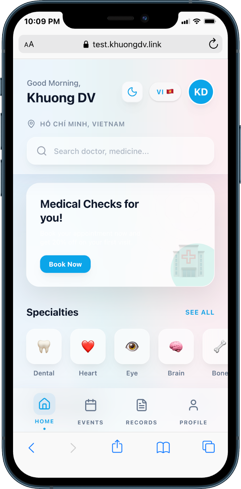
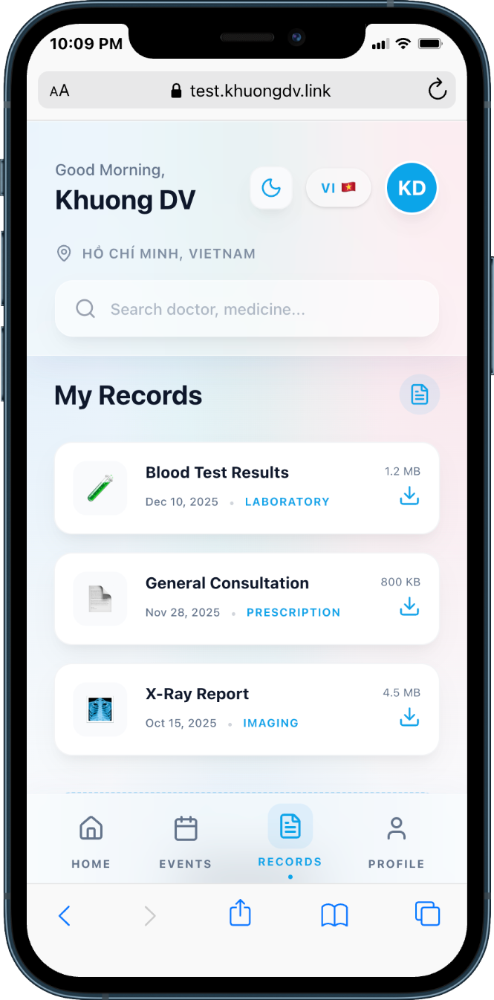

# Health Care App

A modern, responsive health care management application built with React, TypeScript, and Vite. This application features a sleek "Glassmorphism" design inspired by iOS aesthetics, providing a premium user experience for managing health records, events, and personal profiles.

## 🚀 Live Demo

Check out the live application here: **[health-care.khuongdv.link](https://health-care.khuongdv.link)**

## 🎨 Design Preview

Explore the application's clean and intuitive interface:

### 🏠 Home Page



### 📅 Events


### 📂 Health Records



### 👤 Profile


## ✨ Key Features

- **Glassmorphism Design**: High-end visual style with sleek gradients and blurred backgrounds.
- **Progressive Web App (PWA)**: Installable on your device with offline support.
- **Internationalization (i18n)**: Supports multiple languages (English & Vietnamese).
- **Responsive Layout**: Optimized for various screen sizes, especially mobile devices.
- **Health Management**: Track appointments, medical records, and personal health metrics.

## 🛠️ Tech Stack

- **Framework**: [React](https://reactjs.org/) (Vite)
- **Language**: [TypeScript](https://www.typescriptlang.org/)
- **Styling**: Vanilla CSS (Custom Design System)
- **Icons**: [Lucide React](https://lucide.dev/)
- **i18n**: `react-i18next`
- **PWA**: `vite-plugin-pwa`

## 📦 Getting Started

1. **Clone the repository**:

   ```bash
   git clone <repository-url>
   ```

2. **Install dependencies**:

   ```bash
   npm install
   ```

3. **Run the development server**:

   ```bash
   npm run dev
   ```

4. **Build for production**:
   ```bash
   npm run build
   ```
